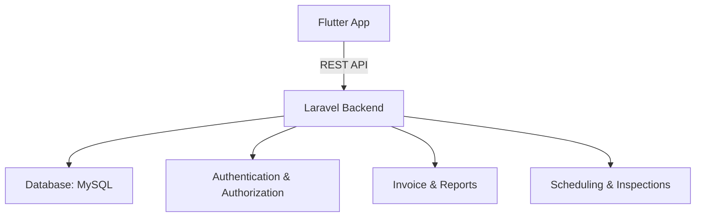

# 🐾 VetPro - Veterinary Health Management System

[](https://flutter.dev/)
[](https://laravel.com/)
[](./LICENSE)

VetPro is a veterinary health management application designed for **DSP Farm Bandung** to digitalize and streamline animal healthcare operations.  
The application improves **medical record-keeping**, **scheduling**, and **invoice management**, replacing manual processes with an efficient, integrated solution.

---

## 📌 Features
- 📋 **Animal Health Records** – Record and manage medical history digitally.  
- 📅 **Scheduling System** – Automatic, conflict-free scheduling for veterinary inspections.  
- 💰 **Invoice Management** – Create, track, and export invoices.  
- 🔑 **Secure Authentication** – Role-based access for veterinarians and farm staff.  
- 📊 **Usability Tested** – Achieved **System Usability Scale (SUS) score of 86.4 (Excellent)**.  

---

## 🛠 Tech Stack
**Frontend**
- Flutter (Dart)  

**Backend**
- Laravel (PHP)  
- MySQL / PostgreSQL  
- RESTful API  

**Tools**
- VS Code / Android Studio  
- Postman (API testing)  
- Git & GitHub (Version control)  

---

## 📐 System Architecture


---

## 🚀 Getting Started
Prerequisites
- Flutter SDK ≥ 3.0
- PHP ≥ 8.0
- Composer
- MySQL

---

Installation
- Backend (Laravel)
```bash
# Clone repository
git clone https://github.com/your-username/vetpro-be.git
cd vetpro-be

# Install dependencies
composer install

# Configure environment
cp .env.example .env
php artisan key:generate

# Setup database
php artisan migrate

# Run server
php artisan serve
```

- Frontend (Flutter)
```bash
# Clone repository
git clone https://github.com/your-username/vetpro-fe.git
cd vetpro-fe

# Install dependencies
flutter pub get

# Run app
flutter run
```

---

## 📊 Testing
Black Box Testing for feature validation

System Usability Scale (SUS) → Score: 86.4 / 100 (Excellent usability)

---

## 📌 Roadmap
 - Push notification for schedules

 - Digital payment integration

 - Enhanced data security (JWT, encryption)

 - Admin dashboard (web)

---

## 📄 License
This project is licensed under the MIT License.
